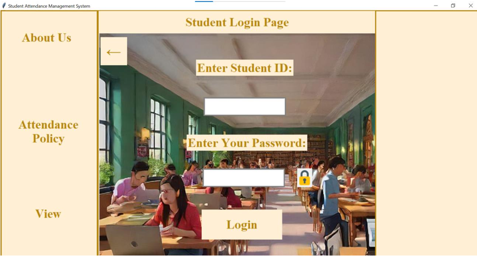
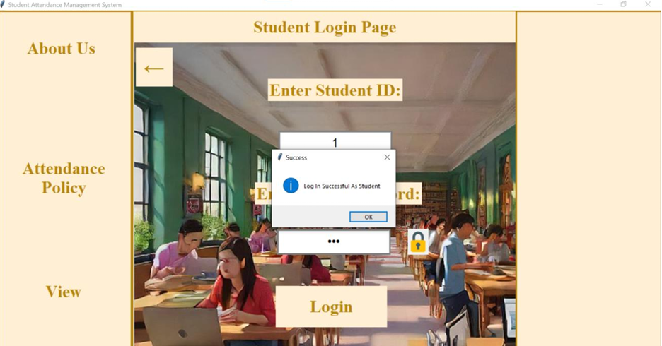
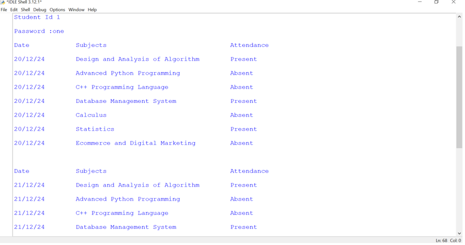
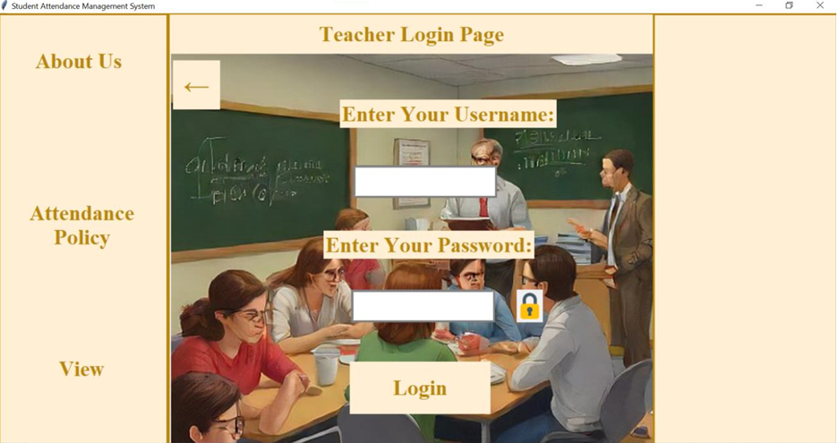
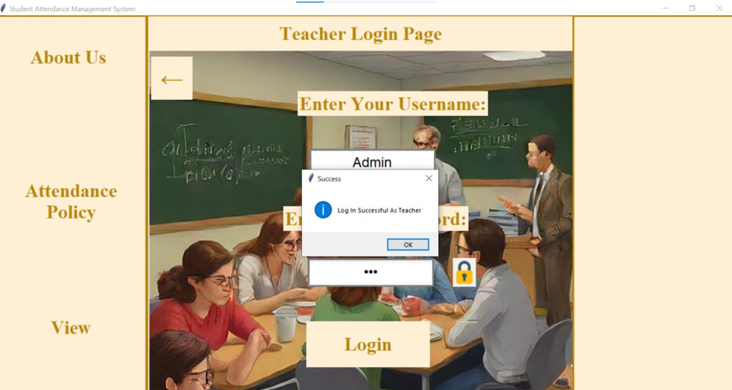
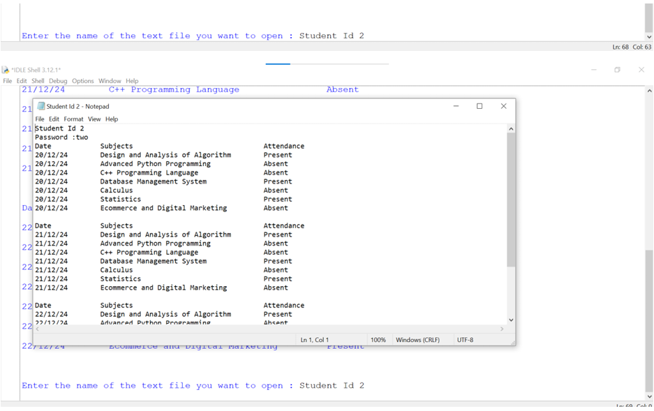
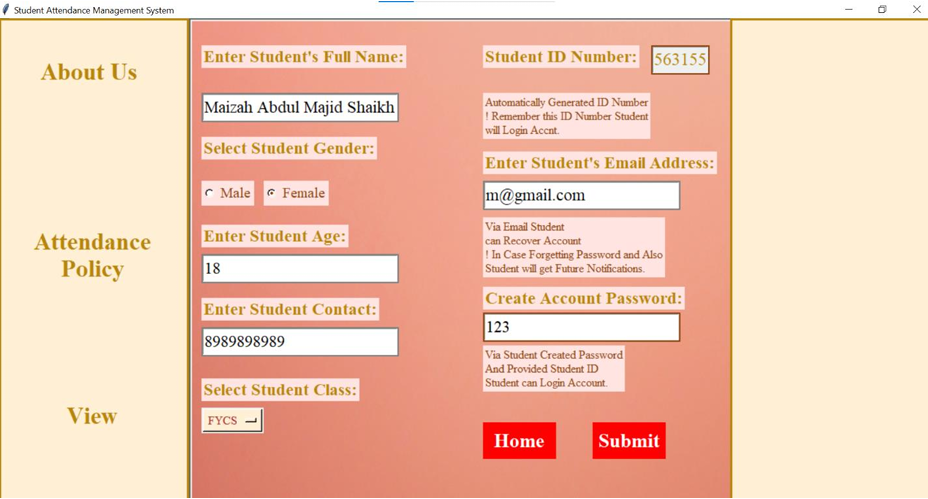
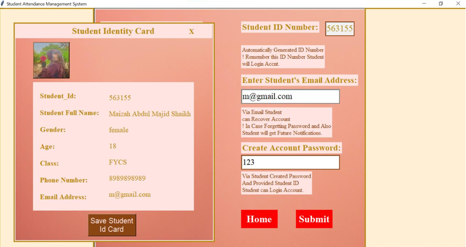
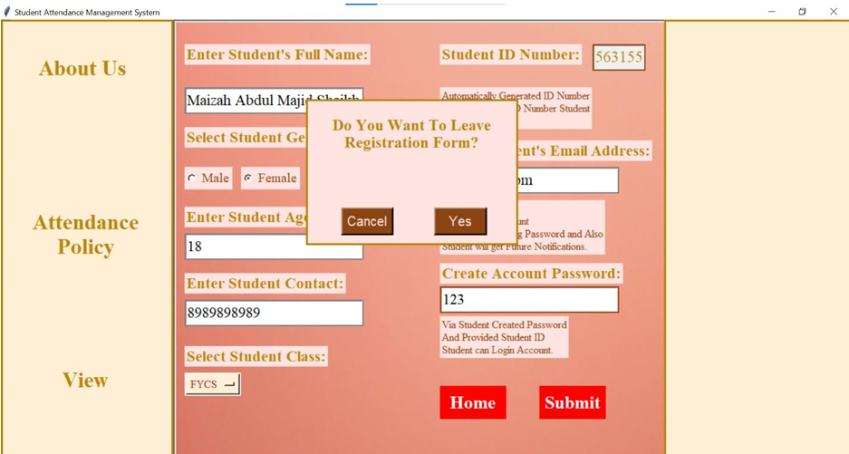

# 📝 Student Attendance Management System

## Overview
The Student Attendance Management System is a desktop application built using Python and Tkinter. It allows students and teachers to manage attendance records efficiently. The application provides functionalities for student login, teacher login, account creation, and generating student identity cards.

## Features
- **User Authentication**: Separate login interfaces for students and teachers.
- **Account Creation**: Allows new students to create accounts with necessary details.
- **Identity Card Generation**: Generates a student identity card with personal details.
- **Attendance Policy Information**: Provides information about attendance policies.
- **User-Friendly Interface**: Intuitive GUI built with Tkinter for easy navigation.

## Limitations
1. Simulation: This application is a simulation and is not intended for real-world use.

2. Student Data Requirement: Before accessing the system, a text file containing student attendance data must be created. This file is necessary for both teachers and students to access their information.

3. Limited User Accounts: The application has been coded to support only the first three students with roll numbers 1, 2, and 3. Their corresponding passwords are "one", "two", and "three", respectively.

4. Dummy ID Generation: The ID generation feature is not functional for actual ID creation. It is designed to demonstrate how to capture a student's image for ID generation and save that image to the user's machine.

5. Teacher Credentials: The teacher's username is "Admin" and the password is "786".

## Requirements
- Python 3.x
- Tkinter (comes pre-installed with Python)
- Pillow (Python Imaging Library) for image handling
**Additional libraries**: re, random, subprocess

## Installation
1. Clone the repository or download the source code.
2. Ensure you have Python installed on your machine.
3. Install the required libraries using pip:

```bash 
pip install Pillow
python main.py
```

## Usage
1. **Welcome Screen**: Choose to log in as a student, teacher, or create a new account.
2. **Student Login**: Enter your Student ID and password to access your account.
3. **Teacher Login**: Enter the admin username ("Admin") and password ("786") to access teacher functionalities.
4. **Create Account**: Fill in the required details to create a new student account.
5. **Generate Identity Card**: After account creation, generate an identity card with your details.

## Contributors
**Maizah Shaikh**
**Faiza Sayed**

## Screenshots













## Contributing
Contributions are welcome! If you have suggestions for improvements or new features, feel free to create a pull request.

## License
This project is licensed under the MIT License

## Acknowledgments
Thanks to the contributors and the open-source community for their support.

**Maizah Shaikh**  
[LinkedIn](https://www.linkedin.com/in/maizah-shaikh-a5bba82a9) | [GitHub](https://github.com/maizahshaikh1004)
